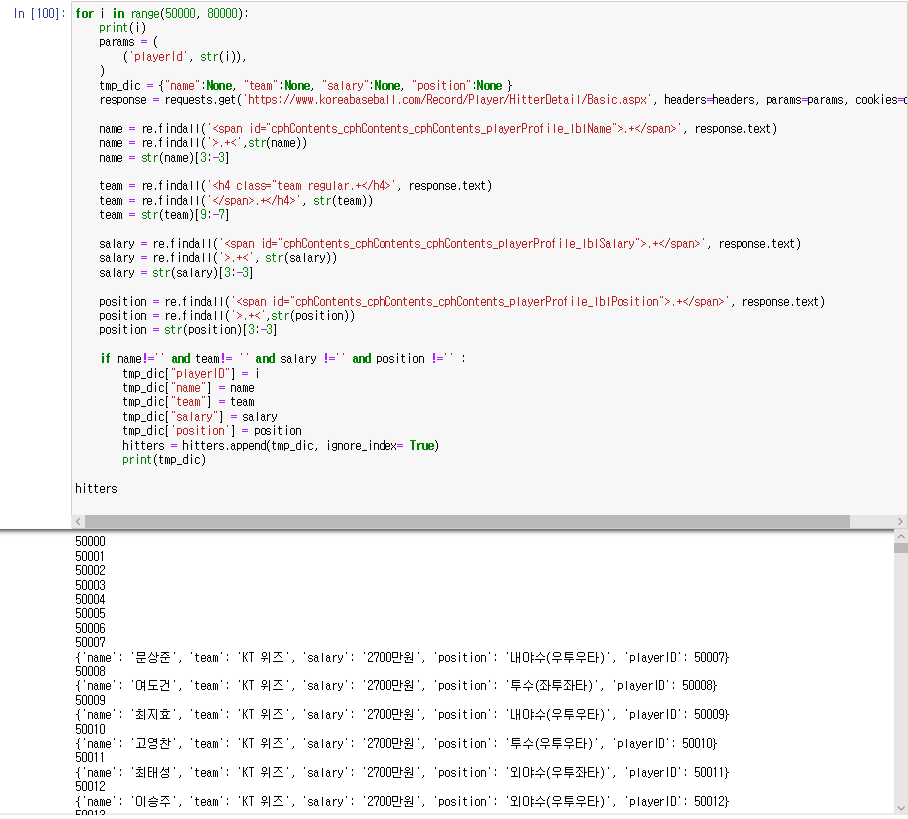
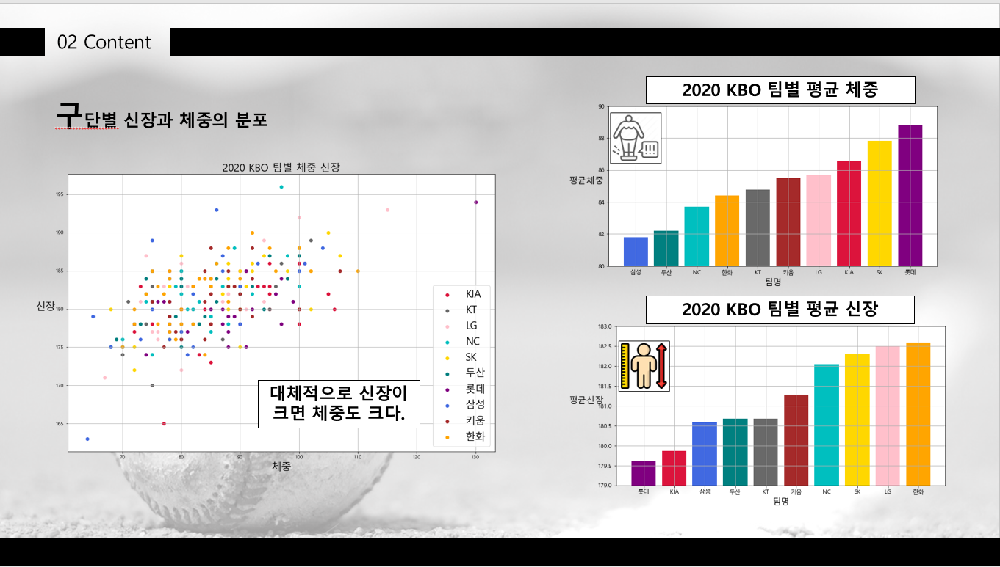
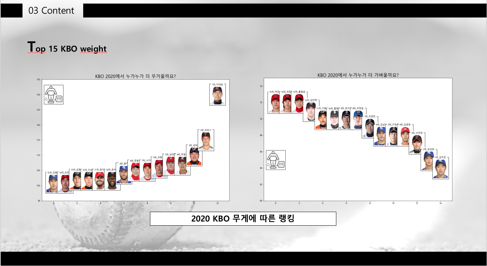
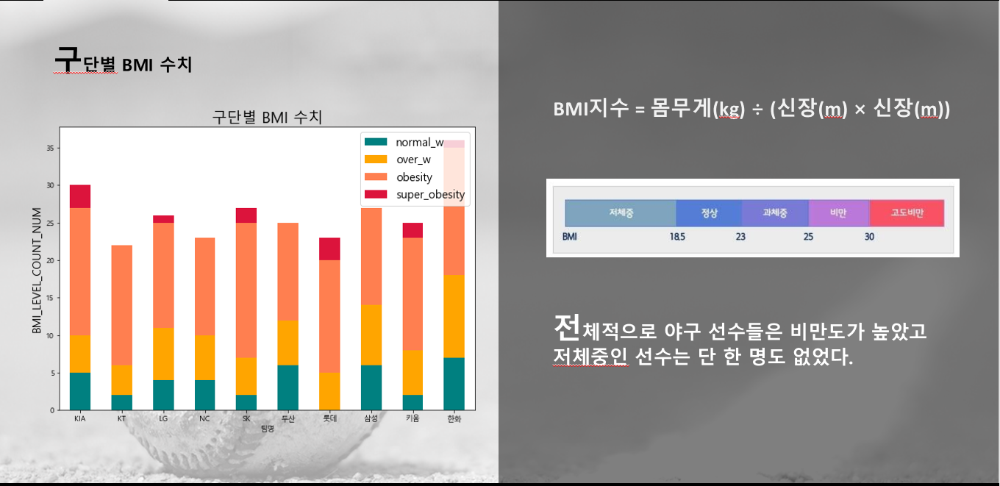
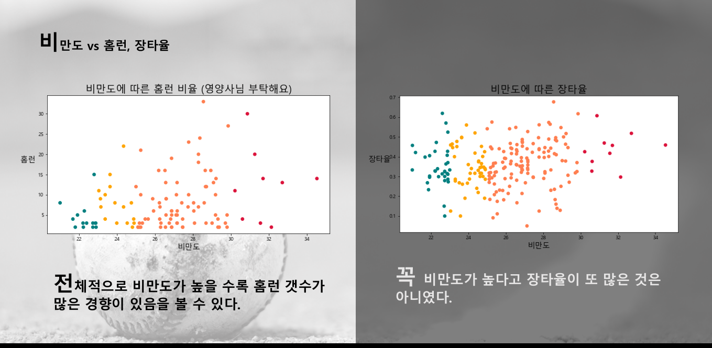
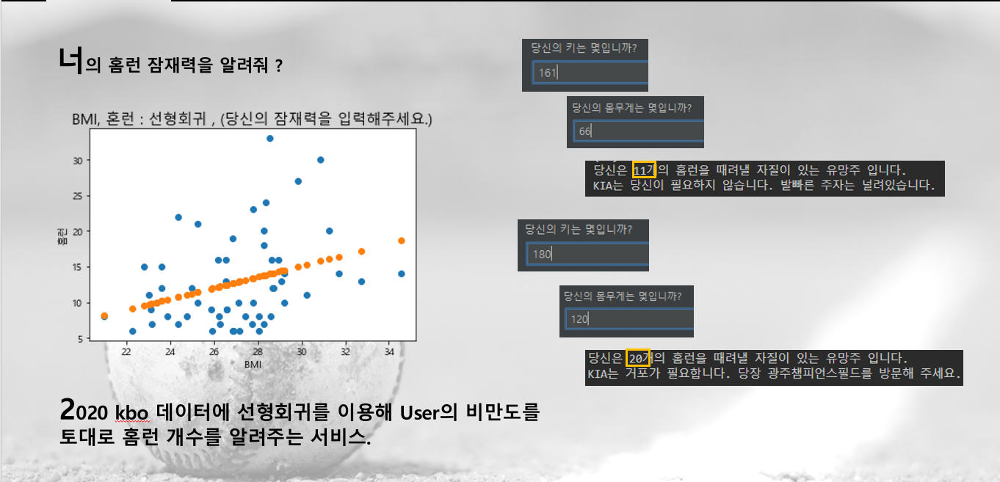
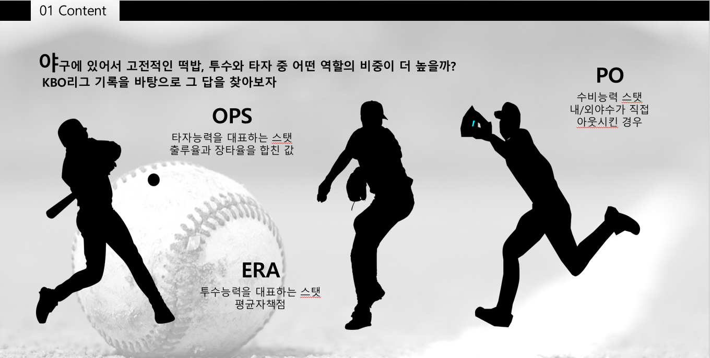
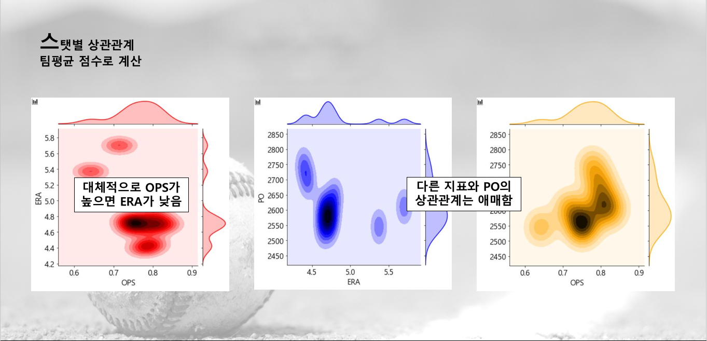
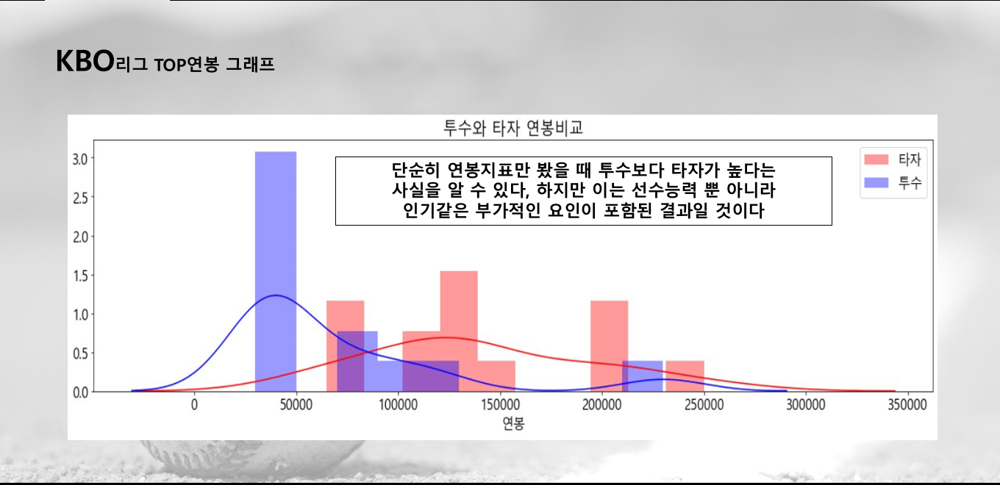

# 주제: 2020 KBO 데이터들을 시각화하기

# 구글밋: https://meet.google.com/oib-ruww-cqe

## 데이터 출처:
<ol>
<li>KBO 기록실: https://www.koreabaseball.com/Record/Player/HitterBasic/Basic1.aspx</li>
<li>스탯티즈: http://www.statiz.co.kr/main.php</li>
<li>투구 데이터: https://strikes.zone/game/200830SS</li>
<li>DACON 타자 데이터: https://dacon.io/competitions/official/235546/data/
</ol>

## 분석하고 싶은 것:
  1. KBO 연봉 분포, 연봉에 따른 실력 차이가 존재하는가, 고액 연봉을 받지만 성적을 못내는 먹튀는 누구인가? (인준)
  2. 구단별 비만도 조사 및 경기력에 미치는 영향  (시몬)
  3. 팀별 투수, 타자, 수비 각각의 성적이 구단성적에 얼마나 영향을 끼치는가? (범희)
  4. 타자의 키/체중과 도루 등의 연관성은?  (동현)

## 데이터를 얻는 과정
  KBO 공식 홈페이지에서 선수들의 기록들을 보여주고 있었지만, csv 파일의 형태로 제공하고 있지는 않았다. 그래서 크롤링이 필요했다. 
  
  

## 데이터를 얻고나서 알고 싶은 사항에 대해 EDA 및 시각화를 하였다
  
  
  
  
  
  
  
  
  
  
  
